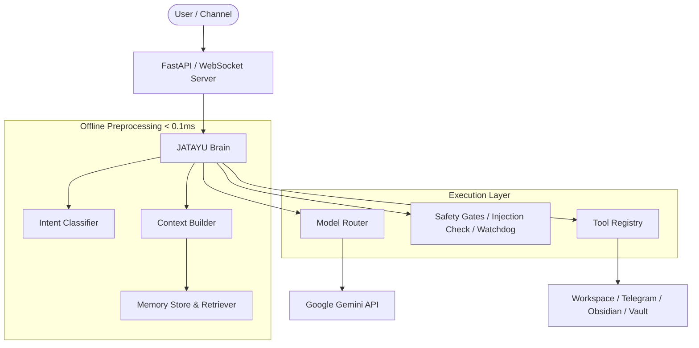

# JATAYU Core v1.0 — Architecture Overview

JATAYU Core is an autonomous AI coding and personal assistant OS designed for local, deterministic, and sub-millisecond offline intelligence.

---

## 1. Core Principles

1. **Deterministic Offline Preprocessing**: Intent classification and tool filtering happen locally in < 0.1 ms before any network request to an LLM.
2. **Minimal Tool Surface**: Never expose all 40+ tools to the model at once. Dynamically narrow exposed tools based on the classified intent.
3. **Session & State Isolation**: Each user or communication channel operates in an isolated `SessionState` protected by threading locks and explicit lifecycle state transitions.
4. **No Hidden Abstractions**: No frameworks (LangChain, LlamaIndex, etc.) are used in JATAYU Core. All subsystems (memory, tools, safety, routing) are vanilla Python 3.11 modules.

---

## 2. System Layer Diagram

---

## 3. Subsystem Summary

- **Brain (`jatayu/brain.py`)**: The central orchestrator managing multi-turn conversations, tool loops, session locking, and error recovery.
- **Intent Classifier (`jatayu/pipeline/intent_classifier.py`)**: Fast regex and keyword heuristic classifier mapping raw text to actionable intent domains.
- **Context Builder (`jatayu/pipeline/context_builder.py`)**: Assembles `ContextPacket` containing only task-relevant entities, memories, and tools.
- **Tool Registry (`jatayu/tools/__init__.py`)**: Standardized execution interface with monotonic latency auditing (`execute_with_timing`) and idempotency tracking.
- **Memory Store & Retriever (`jatayu/memory/`)**: Durable JSON-backed fact storage (`store.py`) with term-overlap relevance scoring and protected category floors (`retriever.py`).
- **Safety Gates (`jatayu/safety/`)**: Prompt injection sanitization, manual UI confirmation gates for sensitive actions, and watchdog timers.
