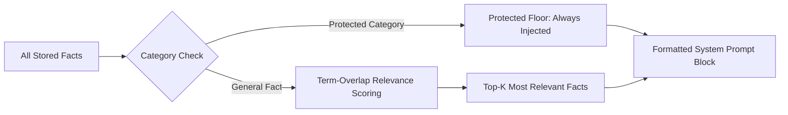

# JATAYU Core v1.0 — Memory & Context Architecture

JATAYU Core implements a lightweight, high-performance hybrid memory system that combines durable fact storage with relevance-scored system prompt injection.

---

## 1. Storage Layers

1. **Long-Term Memory (`data/memory.json`)**:
   - Stored via `jatayu.memory.store` as human-readable JSON records.
   - Each fact is a clear, self-contained statement (e.g., `"Prefers concise code reviews."`).
   - Managed via the `remember` tool or direct user file editing.

2. **Entity Memory (`data/entities.json` & SQLite)**:
   - Tracks contacts (`person`) and initiatives (`project`).
   - Lazy-loaded: Entity details are NOT injected into the prompt by default. The model calls `get_person` or `get_project` when specific names appear in conversation.

---

## 2. Context Retrieval & Protected Floors (`retriever.py`)

To prevent prompt bloat while guaranteeing critical context is never forgotten, `ContextRetriever` applies two-tier filtering:

### Protected Categories
Facts belonging to the following categories bypass scoring entirely and are **always** injected into the system prompt:
- `identity`
- `preference` / `preferences`
- `standing_instructions` / `standing_instruction`

### Term-Overlap Relevance Scoring
For non-protected facts, `ContextRetriever` tokenizes the user's current message and calculates term-overlap ratios against stored facts. Only the top $K$ ($K=15$ default) highest-scoring facts are returned, executing in **~0.03 ms**.
