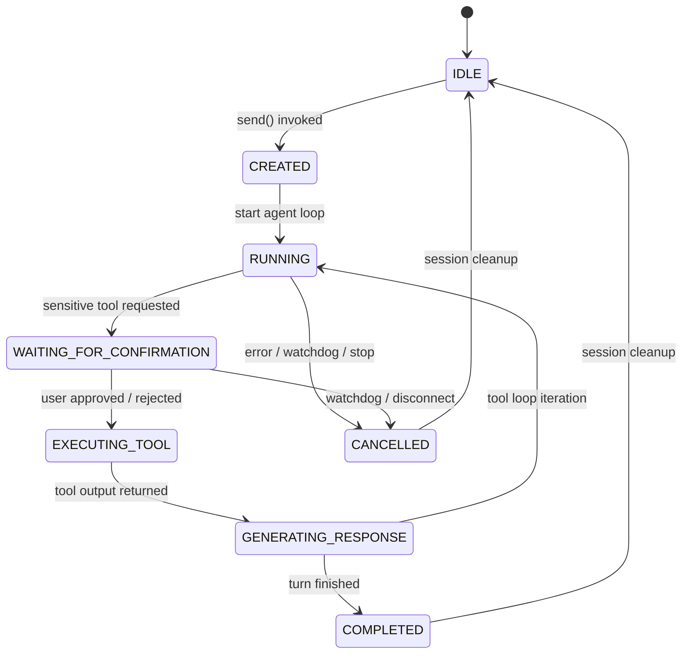

# JATAYU Core v1.0 — Request Lifecycle & State Management

To guarantee runtime stability and prevent watchdog deadlocks during manual user confirmations, JATAYU Core enforces a single authoritative request lifecycle state.

---

## 1. Authoritative State Machine (`RequestState`)

Defined in `jatayu.brain.RequestState`, every request transitions through explicit states:

---

## 2. State Definitions

| State | Description | Watchdog Behavior |
| :--- | :--- | :--- |
| `IDLE` | Session is inactive and ready for new requests. | Inactive |
| `CREATED` | Request received; session lock acquired; cleanup baseline ensured. | Inactive |
| `RUNNING` | Active LLM streaming or preprocessing in progress. | Active (counting towards ceiling) |
| `WAITING_FOR_CONFIRMATION` | Execution paused while waiting for user approval via WebSocket UI. | **PAUSED** — Watchdog timer is suspended so user confirmation never times out. |
| `EXECUTING_TOOL` | Tool handler executing in `ToolRegistry`. | Active |
| `GENERATING_RESPONSE` | Model generating final text response after tool execution. | Active |
| `COMPLETED` | Request completed successfully. | Inactive |
| `CANCELLED` | Request cancelled due to user stop, exception, or timeout. | Inactive |

---

## 3. Session Cleanup & Lock Safety

Every request executed via `brain.send()` is wrapped in a Python threading `Lock` and an unconditional `finally` block:
1. **Pre-turn Cleanup**: `session.cleanup()` resets any lingering confirmation futures or cancellation flags before starting.
2. **Audit Logging**: `log_request_lifecycle()` emits an audit record containing total latency, LLM latency, tool execution trace, and state transitions to `data/audit.log`.
3. **Post-turn Cleanup**: `session.cleanup()` returns the session to `IDLE` and cancels any orphaned UI confirmation prompts upon completion or disconnect.
